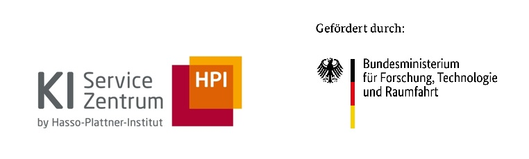
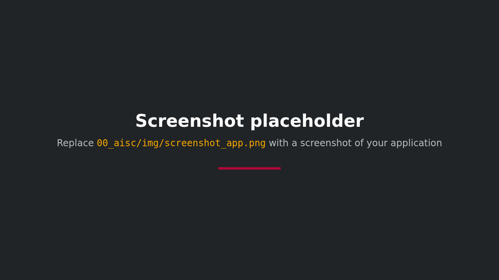

<div style="background-color: #ffffff; color: #000000; padding: 10px;">

<h1>Library Hackathon: AI Workflows Without Coding</h1>
</div>

**English** | [Deutsch](README.de.md)

A demo and working environment for hackathons with information professionals from academic libraries. Groups build AI workflows and AI agents in [Langflow](https://www.langflow.org/) by drag and drop, without writing code, for real tasks in academic libraries: checking references, analysing the sources of a thesis, collecting literature across publishers and finding research gaps. The kit ships ready-made example flows, custom library components (Crossref, OpenAlex, Unpaywall, hbz union catalogue) and guides.

The hackathon itself runs in German: the example flows, the components and the guides in [`anleitungen/`](anleitungen/) are all in German.



## Features

- **Visual instead of code**: flows are put together in Langflow from building blocks. Every example flow explains itself with a note directly on the canvas.
- **Five ready-made example flows** as starting points for the challenges:

  | Flow | What it does |
  | --- | --- |
  | `00 Erste Schritte – Hallo KI` | The smallest possible flow: question, instruction, answer |
  | `01 Referenz-Checker` | Checks a reference list against Crossref: existence, year, first author, DOI, retracted articles |
  | `02 Masterarbeit – Quellen analysieren` | Reads a PDF, cuts out the reference list, enriches every source via OpenAlex and has the AI assess the source base |
  | `03 Literaturreview – Forschungslücken finden` | Research question → search terms → cross-publisher search → open full texts → themes, contradictions, research gaps |
  | `04 Recherche-Agent` | An AI agent that decides for itself whether to search for articles, query the catalogue or check references |

- **Library components** (category *Bibliothek* in Langflow):

  | Component | Source |
  | --- | --- |
  | KI-Modell (AI model) | Cluster (LiteLLM) or local (Ollama), switchable |
  | Literaturangaben prüfen (check references) | Crossref (including Retraction Watch), DataCite |
  | Literaturverzeichnis finden (find reference list) | Cuts the reference list out of long documents |
  | Quellen anreichern (enrich sources) | Crossref + OpenAlex, with statistics |
  | Literatursuche (literature search) | OpenAlex (with Crossref as a search index when needed) |
  | Volltexte holen (fetch full texts) | Open PDFs via OpenAlex and Unpaywall |
  | Katalogsuche (catalogue search) | hbz union catalogue via lobid.org |

  All components except *KI-Modell*, *Literaturverzeichnis finden* and *Volltexte holen* can also be used as tools by agents.
- **Cluster or local**: by default the flows use a model through a LiteLLM endpoint. Anyone who doesn't want data to leave the building (unpublished theses, for example) can switch to a local model with Ollama.

## Setup and Installation

### Prerequisites

- [Docker Desktop](https://www.docker.com/products/docker-desktop/) (Windows, macOS) or Docker with Docker Compose (Linux)
- Credentials for the LiteLLM endpoint (from the organisers) **or** a local model via [Ollama](https://ollama.com/)
- Internet access (for Crossref, OpenAlex, Unpaywall and lobid)

### Quick Start

The short version is below. The full [installation guide](INSTALL.md) covers each operating system, local models, preparing many laptops and troubleshooting.

1. Download the repository (green *Code → Download ZIP* button, then unzip) or clone it:

   ```bash
   git clone https://github.com/aihpi/demo-bibliothekshackaton.git
   cd demo-bibliothekshackaton
   ```

2. Create the settings file: copy `.env.example`, name the copy `.env` and fill in the values from the organisers. The start scripts from step 3 also create `.env` on the first run and open it for you.

   ```bash
   cp .env.example .env
   ```

3. Start it by double-clicking `starten.command` (macOS) or `starten.bat` (Windows), or run:

   ```bash
   docker compose up -d
   ```

   For a local model in Docker, add `--profile lokal` (downloads a few GB on the first start).

4. Open Langflow at <http://localhost:7860>. The example flows are in the project *Starter Project*.

### Updating

With Git, run this in the project folder:

```bash
docker compose down
git pull
docker compose up -d
```

Without Git, and for what to watch out for (your own flows, the example flows), see [Update to the latest version](INSTALL.md#update-to-the-latest-version) in the installation guide.

## User Guide

### Using the Tool

The detailed guides are in [`anleitungen/`](anleitungen/) (German):

1. [**Guide for participants**](anleitungen/01_teilnehmende.md): installing, starting, the first flow, building your own flows, common problems.
2. [**Challenges**](anleitungen/02_challenges.md): the hackathon tasks, each in three levels.
3. [**Guide for organisers**](anleitungen/03_orga.md): preparation, credentials, schedule, troubleshooting, maintenance.

The [component guide](COMPONENTS.md) explains every component in Langflow's sidebar, with its inputs and outputs, in the order participants find them.

Sample data is in [`daten/`](daten/): a reference list with deliberate errors and a fictional master's thesis as a PDF.

### Recommendations

- Add a free [OpenAlex API key](https://openalex.org/settings/api) to `.env`. Without a key, OpenAlex throttles searches under load, and all groups on the same Wi-Fi share the limit.
- Add a contact email (`KONTAKT_EMAIL`): Crossref then answers faster, and Unpaywall finds additional open full texts.
- Agents (flow 04) need models that can use tools. This works most reliably with the cluster.

## Limitations

- **Small local models** (such as `qwen3.5:4b`) are slow and make more mistakes: they invent source numbers or ignore parts of the instructions. That makes for a good discussion about checking AI output, but it's no substitute for a large model.
- **Database coverage**: Crossref and OpenAlex mostly know journal articles. Books, grey literature and websites are often missing. That's what the catalogue search is for.
- **Full texts** are only available for open access publications, and not every PDF can be read automatically.
- **The Langflow interface is in English**; the participant guide translates the most important terms.

## For Developers

The flows in `flows/` are not edited by hand. [`scripts/flows_bauen.py`](scripts/flows_bauen.py) generates them through the Langflow API, so the code and fields always match the installed Langflow version:

```bash
docker compose up -d
uv run --with httpx scripts/flows_bauen.py --testen   # build, run every flow once, export
```

The components are in [`komponenten/bibliothek/`](komponenten/bibliothek/). Langflow reads them at startup; after changing them, run `docker compose restart langflow` and rebuild the flows. The sample thesis is generated with `uv run --with reportlab scripts/beispieldaten_erzeugen.py`.

## References

- [Langflow documentation](https://docs.langflow.org/)
- [Crossref REST API](https://www.crossref.org/documentation/retrieve-metadata/rest-api/), [OpenAlex API](https://docs.openalex.org/), [Unpaywall API](https://unpaywall.org/products/api), [lobid-resources](https://lobid.org/resources/api)
- [LiteLLM](https://docs.litellm.ai/), [Ollama](https://ollama.com/)

## Author

- [Mario Tormo Romero](https://github.com/mt0rm0)

## License

[MIT](LICENSE)

---

## Acknowledgements


The [AI Service Centre Berlin Brandenburg](https://hpi.de/kisz) is funded by the [Federal Ministry of Research, Technology and Space](https://www.bmftr.bund.de/) under the funding code 16IS22092.
