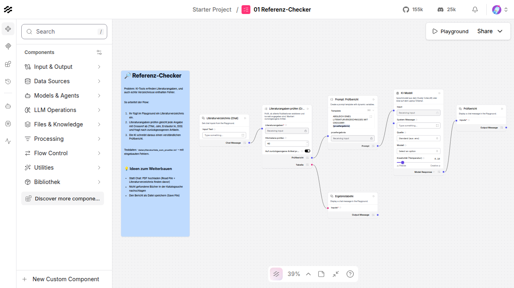
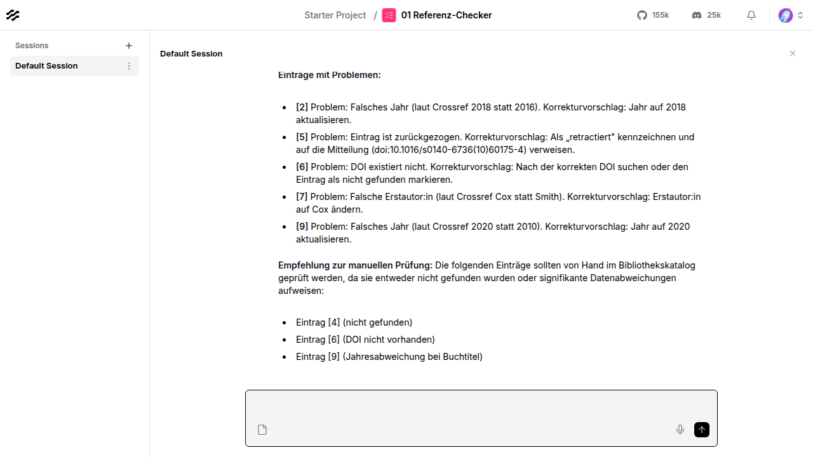

# Anleitung für Teilnehmende

Diese Anleitung führt euch vom leeren Laptop bis zum eigenen KI-Workflow. Programmierkenntnisse braucht ihr nicht.

## Inhalt

1. [Was ihr heute baut](#1-was-ihr-heute-baut)
2. [Einrichten (einmalig, ca. 20 Minuten)](#2-einrichten-einmalig-ca-20-minuten)
3. [Langflow in fünf Minuten](#3-langflow-in-fünf-minuten)
4. [Den ersten Flow ausführen](#4-den-ersten-flow-ausführen)
5. [Einen Flow verändern](#5-einen-flow-verändern)
6. [Die Bibliotheks-Bausteine](#6-die-bibliotheks-bausteine)
7. [Cluster oder lokales Modell?](#7-cluster-oder-lokales-modell)
8. [Tipps für gute Prompts](#8-tipps-für-gute-prompts)
9. [Wenn etwas nicht klappt](#9-wenn-etwas-nicht-klappt)
10. [Kleines Wörterbuch](#10-kleines-wörterbuch)

---

## 1. Was ihr heute baut

Ihr baut **Flows**: Ketten aus Bausteinen, die Daten Schritt für Schritt verarbeiten. Ein Baustein holt zum Beispiel Metadaten aus einer Literaturdatenbank, ein anderer lässt ein Sprachmodell (eine „KI“) einen Bericht schreiben.

Für jede Challenge gibt es einen fertigen Beispiel-Flow. Ihr müsst also nicht bei null anfangen, sondern könnt ausprobieren, verändern und erweitern. Die Aufgaben stehen in den [Challenges](02_challenges.md).

## 2. Einrichten (einmalig, ca. 20 Minuten)

> Oft hat die Orga die Laptops schon vorbereitet. Dann weiter mit [Schritt 2.4](#24-starten).

### 2.1 Docker Desktop installieren

Langflow läuft in **Docker**, einer Art „Kiste“, in der Programme fertig eingerichtet mitkommen.

1. [Docker Desktop](https://www.docker.com/products/docker-desktop/) herunterladen und installieren.
2. Docker Desktop öffnen und warten, bis unten links **„Engine running“** steht.

### 2.2 Die Hackathon-Dateien herunterladen

1. Die Projektseite auf GitHub öffnen (Link von der Orga).
2. Auf den grünen Knopf **Code** und dann **Download ZIP** klicken.
3. Die ZIP-Datei entpacken, z. B. auf den Schreibtisch.

### 2.3 Zugangsdaten eintragen

Im entpackten Ordner liegt die Datei `.env.example`. Beim ersten Start wird daraus automatisch die Datei `.env` erzeugt und im Texteditor geöffnet. Tragt dort ein, was ihr von der Orga bekommen habt:

```ini
CLUSTER_BASE_URL=https://…          # Adresse des KI-Clusters
CLUSTER_API_KEY=sk-…                # euer Gruppen-Schlüssel
CLUSTER_MODELL=…                    # Name des Modells
OPENALEX_API_KEY=…                  # falls vorhanden
KONTAKT_EMAIL=…                     # E-Mail-Adresse für Crossref und Unpaywall
```

Speichern, fertig. Den Schlüssel bitte nicht weitergeben.

> Dateien, deren Name mit einem Punkt beginnt, sind auf dem Mac versteckt. Im Finder mit **⌘ + ⇧ + .** sichtbar machen.

### 2.4 Starten

- **Windows:** Doppelklick auf `starten.bat`
- **macOS:** Doppelklick auf `starten.command` (beim ersten Mal: Rechtsklick → *Öffnen*)
- **Linux:** im Terminal `./starten.command`

Beim ersten Start lädt Docker Langflow herunter (knapp 1 GB, einige Minuten). Danach öffnet sich der Browser mit **<http://localhost:7860>**.

**Beenden:** in Docker Desktop den Container `demo-bibliothekshackaton` stoppen. Eure Flows bleiben erhalten.

## 3. Langflow in fünf Minuten

Beim Öffnen seht ihr die Übersicht. Im Projekt **Starter Project** liegen die sechs Beispiel-Flows. Ein Klick öffnet einen Flow.



| Bereich | Was er tut |
|---|---|
| **Linke Leiste** (*Components*) | Alle Bausteine. Unsere eigenen stehen unter **Bibliothek**. Oben gibt es eine Suche. |
| **Arbeitsfläche** (*Canvas*) | Hier liegen die Bausteine. Mit gedrückter Maustaste verschieben, mit dem Mausrad zoomen. |
| **Blaue Notiz** | Erklärt, was der Flow tut und wie ihr ihn erweitern könnt. |
| **Verbindungslinien** | Die Daten fließen von einem Ausgang (Punkt rechts am Baustein) zu einem Eingang (Punkt links). |
| **Playground** (oben rechts) | Der Chat, in dem ihr den Flow ausprobiert. |

Die Oberfläche ist englisch. Die wichtigsten Begriffe:

| Englisch | Bedeutung |
|---|---|
| Input / Output | Eingang / Ausgang eines Bausteins |
| Chat Input / Chat Output | eure Nachricht im Playground / die Antwort im Playground |
| Prompt Template | Anweisung an die KI, mit Platzhaltern in `{geschweiften Klammern}` |
| Read File | Datei hochladen (PDF, Word, Text) |
| Agent | KI, die selbst entscheidet, welche Werkzeuge sie nutzt |
| Toolset / Tool Mode | ein Baustein wird zum Werkzeug für einen Agenten |
| Run / ▶ | Baustein oder Flow ausführen |
| Controls | weitere Einstellungen eines Bausteins |

## 4. Den ersten Flow ausführen

1. Den Flow **00 Erste Schritte – Hallo KI** öffnen.
2. Oben rechts auf **Playground** klicken.
3. Eine Frage eintippen, z. B. *Was ist eine DOI?*, und mit Enter abschicken.
4. Nach ein paar Sekunden erscheint die Antwort.

Dann den **01 Referenz-Checker** ausprobieren: Den Inhalt von `daten/literaturliste_zum_pruefen.txt` in den Playground kopieren und abschicken. Nach etwa einer Minute kommt ein Prüfbericht. Findet ihr alle eingebauten Fehler?



> **Zwischenergebnisse ansehen:** Nach einem Lauf zeigt jeder Baustein unten einen kleinen Ausgabe-Knopf. Ein Klick darauf zeigt, was der Baustein weitergegeben hat, oft als Tabelle. So findet ihr heraus, wo etwas schiefgeht.

## 5. Einen Flow verändern

Bevor ihr etwas verändert: **Kopie anlegen**. In der Übersicht beim Flow auf die drei Punkte → *Duplicate*. Das ist wichtig: Bei jedem Start ersetzt Langflow die Beispiel-Flows durch die Originale, Änderungen direkt darin gehen also verloren.

**Prompt ändern:** Im Baustein *Prompt Template* in das Textfeld klicken. Ihr könnt die Anweisung frei umschreiben. Platzhalter wie `{frage}` erzeugen links am Baustein einen Eingang, an den ihr etwas anschließen könnt. Neuer Platzhalter = neuer Eingang.

**Baustein hinzufügen:** Links in der Leiste suchen (z. B. „Katalog“) und auf die Arbeitsfläche ziehen.

**Verbinden:** Vom Punkt rechts an einem Baustein (Ausgang) zum Punkt links an einem anderen (Eingang) ziehen. Passen die Daten nicht zusammen, lässt Langflow die Verbindung nicht zu.

**Verbindung löschen:** Linie anklicken, dann `Entf` bzw. `Backspace`.

**Einstellungen:** Viele Felder stehen direkt am Baustein. Weitere Einstellungen gibt es über **Parameters** in der kleinen Leiste über dem Baustein.

**Speichern:** Langflow speichert automatisch.

**Exportieren und teilen:** In der Übersicht beim Flow auf die drei Punkte → *Export*. Die JSON-Datei kann eine andere Gruppe über *Upload* wieder importieren.

## 6. Die Bibliotheks-Bausteine

Diese Bausteine wurden für den Hackathon gebaut. Ihr findet sie links unter **Bibliothek**.

| Baustein | Bekommt | Liefert | Wozu |
|---|---|---|---|
| **KI-Modell** | einen Text (Prompt) | die Antwort der KI | Das Sprachmodell. *Quelle*: Standard, Cluster oder Lokal. *Kreativität*: 0 = sachlich, 1 = kreativ. |
| **Literaturangaben prüfen (Crossref)** | ein Literaturverzeichnis | Prüfbericht und Tabelle | Findet erfundene Angaben, falsche Jahre, falsche Autor:innen, ungültige DOIs und zurückgezogene Artikel. |
| **Literaturverzeichnis finden** | einen langen Text, z. B. ein PDF | nur das Literaturverzeichnis | Schneidet das Verzeichnis aus einer Abschlussarbeit aus. |
| **Quellen anreichern (OpenAlex)** | ein Literaturverzeichnis | Überblick mit Statistik und Tabelle | Ergänzt jede Quelle um Abstract, Thema, Zitationen und Open-Access-Status. |
| **Literatursuche (OpenAlex)** | Suchbegriffe (am besten Englisch) | Trefferliste und Tabelle | Sucht in über 250 Mio. Publikationen aller Verlage. Filter: Jahre, nur Open Access, Sortierung. |
| **Volltexte holen (Open Access)** | die Tabelle aus Literatursuche oder Quellen anreichern | Texte für die KI und Tabelle | Lädt freie PDFs und liest den Text aus, sonst das Abstract. |
| **Katalogsuche (hbz / lobid)** | Titel, Autor:in oder Stichwörter | Trefferliste und Tabelle | Sucht Bücher im hbz-Verbundkatalog, gut für Literatur ohne DOI. |

Nützliche Standard-Bausteine von Langflow:

- **Read File**: Dateien hochladen
- **Write File**: Ergebnisse als Datei speichern (z. B. CSV oder Markdown)
- **Parser**: eine Tabelle in Text umwandeln, mit eigener Vorlage wie `{titel} ({jahr})`
- **Batch Run**: die KI jede Zeile einer Tabelle einzeln bearbeiten lassen, z. B. jede Publikation zusammenfassen
- **Agent**: eine KI mit Werkzeugen, siehe Flow 04
- **URL**: den Text einer Webseite holen
- **If-Else / Smart Router**: je nach Ergebnis unterschiedlich weitermachen

**Werkzeug-Modus:** Ein Baustein wird zum Werkzeug für einen Agenten, wenn ihr in seiner Leiste den Schalter **Tool Mode** aktiviert und den Ausgang *Toolset* mit dem Eingang *Tools* des Agenten verbindet.

## 7. Cluster oder lokales Modell?

Im Baustein **KI-Modell** wählt ihr die **Quelle**:

| | Cluster (LiteLLM) | Lokal (Ollama) |
|---|---|---|
| Wo läuft die KI? | auf einem Rechenzentrum der Orga | auf eurem Laptop |
| Qualität | groß und zuverlässig | klein, macht mehr Fehler |
| Tempo | schnell | langsam, besonders ohne Grafikkarte |
| Daten | verlassen den Laptop | bleiben auf dem Laptop |
| Agenten (Werkzeuge) | funktionieren gut | oft unzuverlässig |

*Standard (aus .env)* nimmt, was die Orga voreingestellt hat. Im Feld **Modell** könnt ihr mit dem kleinen Pfeil-Knopf die verfügbaren Modelle laden und eines auswählen.

**Wann lokal?** Wenn es um Daten geht, die das Haus nicht verlassen sollen, z. B. unveröffentlichte Abschlussarbeiten oder Anfragen von Nutzer:innen. Das ist eine gute Diskussionsfrage für eure Präsentation.

## 8. Tipps für gute Prompts

- **Rolle geben:** „Du bist Fachreferent:in für Geschichte …“
- **Aufgabe klar benennen:** „Schreibe einen Prüfbericht mit genau drei Abschnitten: …“
- **Format vorgeben:** „Antworte als Tabelle mit den Spalten Nr., Problem, Vorschlag.“
- **Grenzen setzen:** „Verwende nur die Informationen oben. Erfinde nichts. Wenn etwas fehlt, sag es.“
- **Zielgruppe nennen:** „Für Studierende im ersten Semester, in einfacher Sprache.“
- **Lange Daten zuerst, Anweisung am Schluss:** Bei viel Text die Daten oben und die Aufgabe unten in den Prompt schreiben.
- **Mit Beispiel zeigen:** Ein Beispiel für eine gute Antwort wirkt oft besser als eine lange Beschreibung.
- **Ergebnisse prüfen:** Sprachmodelle klingen immer überzeugt, auch wenn sie falsch liegen. Stichprobenartig nachprüfen!

## 9. Wenn etwas nicht klappt

| Problem | Lösung |
|---|---|
| Browser zeigt „Seite nicht erreichbar“ | Langflow startet noch, eine Minute warten. Läuft Docker Desktop? |
| „Keine Adresse für das KI-Modell“ | In der `.env` fehlt `CLUSTER_BASE_URL`, oder im KI-Modell *Lokal* wählen. |
| „401“ oder „Authentication“ | Der Schlüssel `CLUSTER_API_KEY` stimmt nicht. Bei der Orga nachfragen. |
| „Kein Modell gewählt“ | Im KI-Modell ein Modell auswählen oder `CLUSTER_MODELL` in der `.env` setzen. |
| Lokales Modell: „connection refused“ | Läuft Ollama? Mit `docker compose --profile lokal up -d` gestartet oder Ollama-App geöffnet? |
| Sehr langsame Antworten | Lokales Modell ohne Grafikkarte: Cluster nehmen oder weniger Text schicken (*Höchstens Dokumente*, *Zeichen pro Dokument*). |
| KI antwortet auf Englisch oder ignoriert die Anweisung | Zu viel Text für das Modell. Weniger Dokumente nehmen, Anweisung ans Ende des Prompts. |
| „OpenAlex-Suche gesperrt“ | Ohne API-Schlüssel ist OpenAlex bei Last gesperrt; der Baustein sucht dann über Crossref. Besser: `OPENALEX_API_KEY` eintragen. |
| „Crossref nicht erreichbar“ / Fehler 429 | Zu viele Anfragen. Kurz warten und erneut starten. |
| Der Agent sagt, er habe gesucht, aber zeigt nichts | Kleine Modelle „tun so“, als hätten sie Werkzeuge benutzt. Cluster-Modell nehmen. |
| Die KI erinnert sich an alte Antworten | Im Playground links eine neue Sitzung starten (**+**). |
| Etwas ist kaputt | Den Flow aus `flows/` neu importieren (*Upload*) oder die Orga fragen. |

## 10. Kleines Wörterbuch

| Begriff | Bedeutung |
|---|---|
| **Flow / Workflow** | Eine Kette von Bausteinen, die gemeinsam eine Aufgabe erledigen |
| **Baustein / Komponente** | Ein Kästchen auf der Arbeitsfläche, das eine Sache tut |
| **Sprachmodell / LLM** | Die „KI“, die Texte liest und schreibt (Large Language Model) |
| **Prompt** | Die Anweisung an das Sprachmodell |
| **Token** | Die Einheit, in der Sprachmodelle Text zählen, etwa ¾ Wort |
| **Kontext** | Wie viel Text ein Modell auf einmal lesen kann |
| **Agent** | Ein Sprachmodell, das selbst Werkzeuge auswählt und benutzt |
| **Halluzination** | Eine erfundene, aber überzeugend klingende Antwort |
| **DOI** | Dauerhafte Kennung einer Publikation, z. B. `10.1038/sdata.2016.18` |
| **Crossref** | Registrierungsstelle für DOIs mit Metadaten zu über 170 Mio. Publikationen |
| **DataCite** | Registrierungsstelle für DOIs von Forschungsdaten, Software und Berichten |
| **OpenAlex** | Freier Katalog der Wissenschaft mit Abstracts, Themen und Zitationen |
| **Unpaywall** | Dienst, der frei zugängliche Versionen von Artikeln findet |
| **Open Access (OA)** | Frei und kostenlos zugängliche Publikationen |
| **Retraction Watch** | Datenbank zurückgezogener Artikel, in Crossref integriert |
| **lobid** | Offene Schnittstelle zum hbz-Verbundkatalog |
| **LiteLLM** | Vermittlungsdienst, über den der Cluster viele Modelle anbietet |
| **Ollama** | Programm, das Sprachmodelle auf dem eigenen Rechner ausführt |
